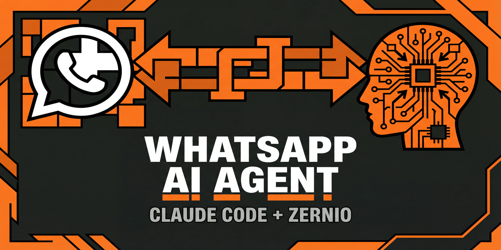

# WhatsApp AI Agent



Your own AI receptionist on WhatsApp. Powered by Claude Code. Zero API costs.

Customers text your WhatsApp number. An AI agent reads your business details, answers their questions, books appointments, and escalates what it can't handle. Runs 24/7 for ~$12/month.

## How It Works

```
Customer texts → Zernio receives → Bridge catches webhook → Claude Code replies → Customer gets answer
```

The bridge script receives incoming WhatsApp messages via Zernio webhooks and uses `claude -p` (Claude Code's CLI mode with OAuth) to generate intelligent responses based on your business knowledge in `BUSINESS.md`. No API key needed. No per-message costs for the AI.

## Quick Start

### Prerequisites

- [Claude Code](https://claude.ai/claude-code) installed and logged in
- [Node.js](https://nodejs.org) 18+
- A way to expose a port to the internet (Cloudflare Tunnel, Tailscale, or a VPS)

### Setup

```bash
git clone https://github.com/aigrowthpartner/whatsapp-agent.git
cd whatsapp-agent
claude
```

Claude Code reads `SETUP.md` and walks you through everything:

1. Create a Zernio account and get an API key
2. Buy a WhatsApp number ($2/mo)
3. Fill in your business details
4. Start the bridge
5. Connect the webhook
6. Test it

The entire setup takes about 15 minutes.

### Manual Setup

If you prefer to set things up yourself:

```bash
cp .env.example .env
# Edit .env with your Zernio credentials
# Edit BUSINESS.md with your company details
node bridge.mjs
# Expose port 18800 to the internet
# Add webhook URL in Zernio dashboard
```

## What's Inside

```
whatsapp-agent/
├── CLAUDE.md        # Agent behavior (how it responds)
├── SETUP.md         # Interactive setup guide (Claude follows this)
├── BUSINESS.md      # Your business details (edit this)
├── bridge.mjs       # Webhook bridge (one file, no dependencies)
├── .env.example     # API key template
├── conversations/   # Chat history per customer (auto-created)
├── memory/          # Daily logs (auto-created)
└── escalations/     # Items needing human attention (auto-created)
```

## Costs

| Item | Cost |
|------|------|
| Zernio WhatsApp number | $2/mo |
| Zernio Inbox add-on | $10/mo |
| AI processing (Claude Code OAuth) | Free |
| Server (VPS) | $4-10/mo |
| **Total** | **~$12-22/mo** |

No per-message AI costs. Claude Code uses your OAuth login.

## Customization

Everything about the agent's behavior is in `CLAUDE.md`. Edit it to change:
- Response style and tone
- What it handles vs escalates
- Message length
- Logging behavior

Everything about your business knowledge is in `BUSINESS.md`. The more detail you add, the smarter the agent.

## Requirements

- **Claude Code** with an active login (OAuth or API key)
- **Zernio account** with Inbox add-on
- **Node.js 18+**
- **Internet-accessible endpoint** for webhooks (Cloudflare Tunnel recommended)

## License

MIT

---

Built by [AI Growth Partner](https://aigrowthpartner.ai) | WhatsApp powered by [Zernio](https://zernio.com?atp=enriquemarq)
